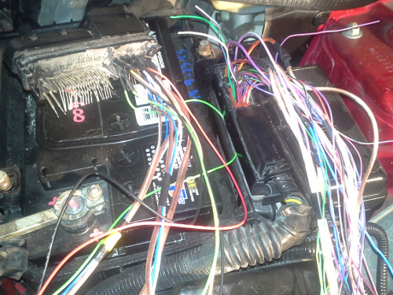
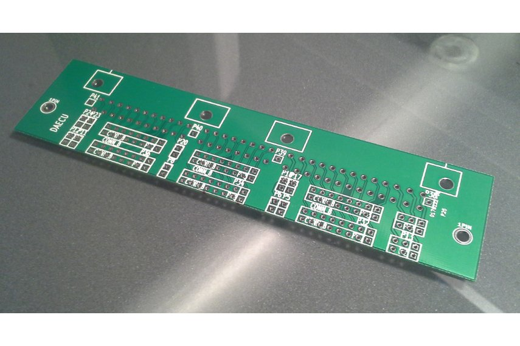
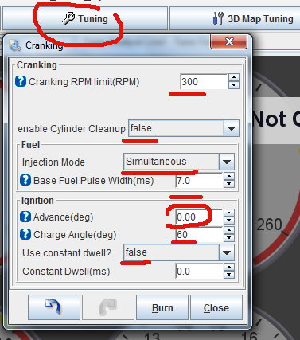
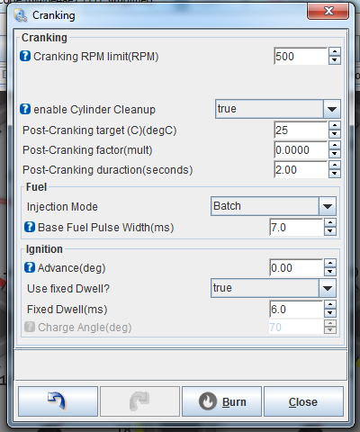

# HOWTO Get Running

[HOWTO create TunerStudio project](HOWTO-create-tunerstudio-project)

## Summary

So you either have hardware under way, or are considering getting rusEFI hardware. This manual is intended for those that are using purchased hardware. If you are not, don't worry, we also encourage DIY and like hearing back from those that have. We also encourage people to use the purchased boards as a starting point for a DIY effort, feel free to modify the board we'll likely make suggestions on how to make your effort better.

## Hardware requirements

### Plan the engine

The engine will need wires that connect to various sensors and devices. You will need crimp tools, soldering tools, and certain electrical and mechanical skills.

We suggest that before you purchase hardware, that you create a plan with a schematic. Even if the schematic is on a napkin, I suggest you take picture of it with your phone or scan it in and get feedback from members in the forum. We can help steer you to a successful build.

#### Start ordering components

Once you have a plan, you can start making a bill of materials. You'll likely be purchasing harnesses, wires, connectors, and all sorts of things. You may have to do junk yard runs to get certain hard to obtain items, ect. If you have your rough schematic at arms length, it will really help you know what you need and when you'll need it.

### Preparing your engine

#### Physically locating the controller

Place some place that is away from hot items like the exhaust. Mount on a piece of steal that can function as a heat sink. Preferably in a dry well ventilated location, were the wires can be easily routed to and from.

#### Route the wires and harnesses

* Start by drawing our your engine layout. This an be as simple as a sketch on a napkin or pizza box. This is handy as it tracks how many injectors you need, what kind of IAC, TPS, IAT, ect options you need.

* It is recommended you route your wires in two different groups, analog and digital/high power. This helps ensure good signals make it to and from the ECU.

* Wire size and fusing go together. The fuse is used to protect the wire against electrical fire. So the wire you can use depends largely on the upstream fuse you select. High-Z injectors are going to draw about 1A, so you can technically get by with tiny stuff like 24AWG or 22AWG. However that is generally not very strong and is prone to breaking and failure. So you would be well advised to follow the NFPA79's suggestion to use a min of 18AWG, as smaller is easily mechanically damaged. In terms of electrical sizing this is very much over sized, which is only suggested to get more rugged mechanical properties.

* You should always reference the MFG's specifications for the wire you are using, as different insulation's have different properties. Some wire is rated for 30A in 18AWG wire, but that is some really special wire which is rated for such conditions. See this general suggestion for general fusing.
  * 18AWG, no larger than a 15A fuse
  * 20AWG, no larger than a 10A fuse
  * 22AWG, no larger than a 7A fuse
  * 24AWG, no larger than a 3A fuse
 Those fuse sizes are based on [this table](http://www.powerstream.com/Wire_Size.htm) for chassis wiring.

* When selecting a fuse, you can use the below guide to help. Generally you choose the fuse and wire based on what the load needs. If your load is 1A capable, you need wire and fusing that can provide at least 1A. However you don't want too large of a wire as it adds costs, or the wire size might be to large for certain connectors, etc.

[Littelfuse Fuseology](http://www.littelfuse.com/~/media/automotive/catalogs/littelfuse_fuseology.pdf)

* Take note there is a fatigue issue known as I2t (That's amps squared time) which is a common reason for failures after several cycles.

* If you want to properly select a fuse, you really need a scope with a current measurement probe, then choose the I2t with the suggested method in the PDF. If you do not have such a scope, make sure to have extra fuses on hand just in case it blows a fuse some time down the road.

* For Frankenso it can typically use a typical automotive blade style fuse. From page 9 of the Frankenso schematic it suggests to use a 1.5A fuse. However that was for the one mounted on the PCB, which generally has a small wire installed. The below 2A would work for an external fuse.

[Littelfuse Mini Data sheet](http://www.littelfuse.com/~/media/automotive/datasheets/fuses/passenger-car-and-commercial-vehicle/blade-fuses/littelfuse_mini_datasheet.pdf)

* Check in the forums for additional information. Often members can identify bumps in the road before you hit them. Forum members can also make suggestions that could make things go smoothly.

* If you do something cool, or new, feel free to share in the forums, Slack, Github, e-mail or where ever. It's common that someone doing something new and cool will get more help than someone doing the same old thing.

#### connecting ECU if it's not plug-and-play

* Start by getting junk yard ECU
* Delicately break apart the junk yard ECU salvaging the ECU connector and perhaps the enclosure.

* If you have a connector that has a break out PCB board for it, you probably want to obtain the break out PCB for that harness connector. If not you can simply solder wires direct to the connector. Similar to [this - Forum](http://rusefi.com/forum/viewtopic.php?f=4&t=507)

* It will likely be helpful to get a partial harness from a junk yard, and switch to rusEFI circuit-by-circuit using a [breakout module.](Breakout-Module)
* Use junk yard harness to make extension harness. Use the junk yard ECU connector to break out the wire harness to the breakout board. Then from the far side of the breakout board, install the junk yard harness connector. Then connect the original ECU. This should allow you to start and run then engine as normal.

#### Prepare engine wiring

* Connect TPS, MAP, IAT, and other such analog signals to the IO board.
* Connect 12V system / battery to the IO board connector.
* Calibrate the sensors using TS and Java console as required.
* Crank engine and see RPM's are registering correctly on the Java Console.
* Connect LED to pins TODO, which will blink at TDC. Verify that TDC is correct by shining on a crank wheel like a timing light. PS: actually right now we do not have this - see [https://github.com/rusefi/rusefi/issues/297](https://github.com/rusefi/rusefi/issues/297) and [https://github.com/rusefi/rusefi/issues/2732](https://github.com/rusefi/rusefi/issues/2732) and [https://github.com/rusefi/rusefi/issues/3120](https://github.com/rusefi/rusefi/issues/3120)
* Connect injectors and ignition as required and see if it will start.

#### Testing the wiring

Once connected you should test the wires. Especially the power wires like coil wires and injector wires. A poor connection with a slight resistance like .1 ohms can cause an electrical fire, which I'm sure you do not want. Once everything is connected measure both the voltage drop and current from the ECU connector, or where ever is applicably appropriate. Using your voltage and current readings, calculate the ohms, if it's above about .1 ohms fix the issue. Take note that .1 ohms at 1A is about .1watt that that connection will have to dissipate. If you have a 12 cyl, and 12 .1 ohm connections, the connector will have to dissipate 1.2 watts.

HOWTO start you engine with rusEFI for the first time

#### test outputs

Both rusEFI console and TS allows you to test if rusEFI properly controls things like injectors (you would hear the clicks), cooling fan (you would hear it - if needed), fuel pump (you would usually hear it - if needed), ignition coil (that's challenging if you have a distributor)

### get tachometer showing correct cranking rpm

Your tuning software should show correct cranking RPM, usually between 150 and 300 with a fully-charged battery.

See also [Trigger](Trigger)

See also [Trigger Hardware](Trigger-Hardware)

### Confirm TDC position

Assuming you have the hardware ready to spark we now need to find your TDC position - we know trigger shape but we do not know the trigger wheel position in relation to TDC#1 (Top Dead Center, cylinder #1).

Set cranking advance angle to zero for now. Use a timing gun while cranking. We now need to try different values of Engine->Trigger->global trigger angle offset until we get spark at zero advance - that's because we might know the relation between TDC#1 and trigger signal.

On Engine Sniffer tab of rusEFI console TDC#1 is shown with the green vertical line.

### cranking parameters

rusEFI has separate cranking control strategy for your first couple of engine revolutions - usually you want more fuel, different timing and simultaneous injection to start an engine.

Engine would start rich, as long as it's not too rich, as long as you have close-enough cranking timing angle. By default, cranking mode is active if RPM is below 500 RPM.

To adjust cranking timing, use `set cranking_timing_angle XXX` command, where XXX is timing advance angle in relation to your trigger synchronization point. Please note that trigger synchronization point often does not match TDC, so just try different values between 0 and 720. For example, try 0, then 20, then 40 etc. Use `showconfig` to see current setting.

See also [Console Timing Commands](Dev-Console-Commands#timing-control)

To adjust cranking fuel, use `set cranking_fuel XXX` command, where XXX is number of total fuel squirt duration in milliseconds. See also [Console Fuel Commands](Dev-Console-Commands#fuel-control)

### running parameters

For first run I suggest running based on MAF sensor - even if you do not have MAF sensor, and flat maps.

`set algorithm 0` would set algorithm: plain MAF

To adjust running timing for your first run, use `set_whole_timing_map XXX` command, where XXX is your timing advance.

To adjust running fuel for your first run, use `set_whole_fuel_map XXX` command, where XXX is number of total fuel squirt duration in milliseconds. This value is usually between 3 and 12. See also [Console Fuel Commands](Dev-Console-Commands#fuel-control)

Once plain MAF works next step is running with proper MAP sensor calibration & flow rate setting.

### next steps & troubleshooting

There are three ways to produce similar logs - the intention is for these three to have same exact data.

1. SD card logging
2. rusEFI console logging
3. TunerStudio logging

See also [https://github.com/rusefi/rusefi/blob/master/firmware/console/binary/output_channels.txt](https://github.com/rusefi/rusefi/blob/master/firmware/console/binary/output_channels.txt)

See also [Error Codes](Error-Codes)

See also [Debug Fields](Debug-Fields)

### External links

[Fuel injectors at first start - Video](https://www.youtube.com/watch?v=lgvt0mh_UB8)

### Diagnostics and trouble shooting of your engine

#### Basic tests

List basic tests here, like is LED on, are jumpers installed correctly if applicable, find hot components and do basic visual checks for burn things and such.

#### Test equipment tests

List tests that can be done with O-Scopes, multimeters, scan tools, and other such options for diagnosing a problem.

#### Get help from a local

We provide much more info than most OEM options. If you are stuck, you may be able to get help from a local mechanic or someone local. Try asking for help in the forums there may be a member or a club meeting that's near by. It's common you can find local people who are willing to help.

#### On board hardware diagnostics

Don't have a scope, no problem, the IO board has basic scope built inside. You can connect pin blah to nearly any point on the board and you can measure a variety of points synchronized with the logging software.
