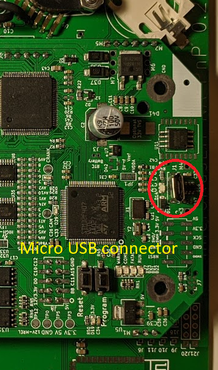
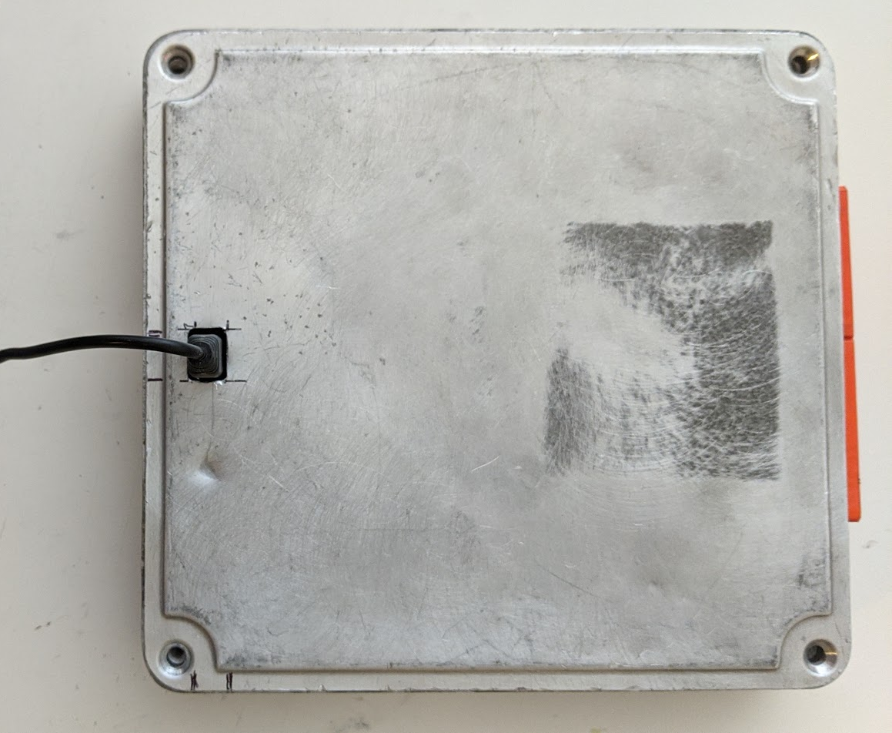
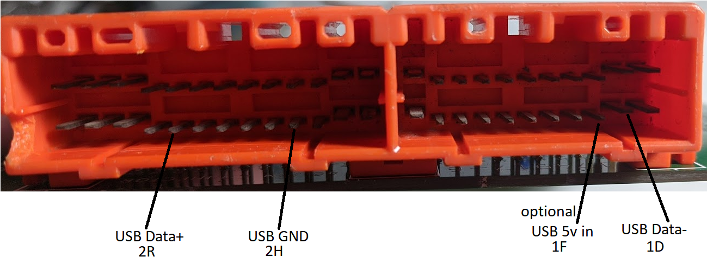
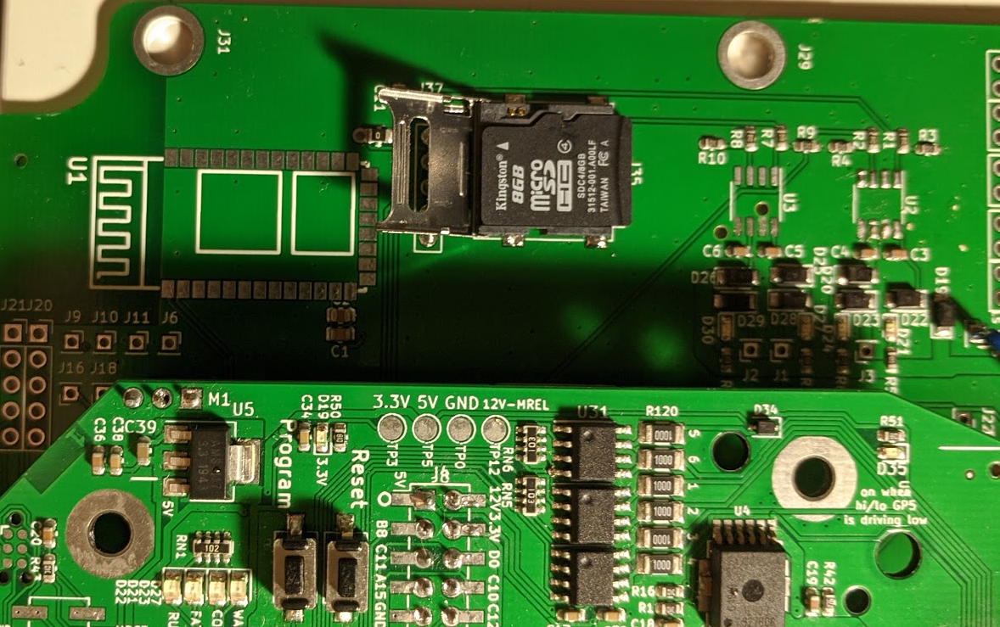
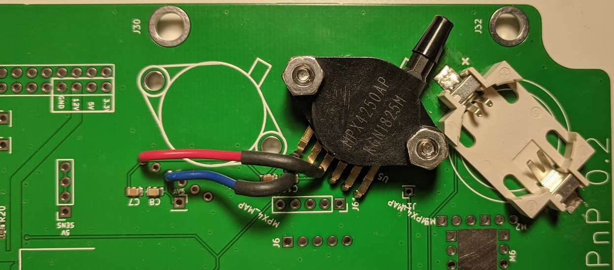

This is a PNP adapter board for NA Miatas (1990-1995). The board is true plug and play. Just replace the PCB in your ECU with this board and drive the car. The hardware capabilities are defined by the [microRuseEFI](Hardware-microRusEfi) module that drives the unit.

Your board should look something like this: 

Currently the only tested configuration is the NA6 Miata with a manual transmission. If you have a different car, we may need your help testing the configuration! Automatic transmission cars are not yet confirmed to work, although there's no reason to think they won't.

The standard configuration runs the engine using the stock AFM (Air Flow Meter) to measure engine load. However, the AFM on early Miatas is an actual restriction in the intake and costs possibly as much as 3hp (this is a guess). It's also useless if you want to add boost to the car- the capability to measure airflow peters out well below the airflow capabilities of even a mild turbo or SC setup. 
The 48 pin board can be equipped with one or two onboard MAP sensors. Alternatively you can also run an external MAP sensor or even a bigger AFM.
The board can be configured for several different options simply by adding/removing some simple SMD jumpers. More custom solutions can be achieved by adding wire jumpers.

# 1. Installation
- Open the stock ECU case
- Remove the stock PCB from the ECU case
- Install the rusEfi board in the ECU case (note: one of the mounting holes, labeled J27, requires a stack of 3 M4 washers- see image below)
- Close the case*
- Plug in connectors and drive

*You may want to not put the lid on the case for now. That makes it easier to connect to the unit with a laptop using a micro USB cable. See below: USB connection.

One of the mounting screws needs three M4 washers because the case has a recessed thread- the stock ECU has a heat sink at that location. The washers may be included with your kit. They go here:

# 2. Standard upgrades over stock
The board should be received set up as a stock replacement unit for your year car. Either a 1990-1993 NA6 or a 1994/1995 NA8. Even in standard configuration it can perform a few tricks the stock ECU just can't.

## 2.1. USB connection
The unit can connect to [TunerStudio](http://www.tunerstudio.com/index.php/tuner-studio) via native USB communication. You can either plug a MiniUSB 
 (or some boards have MicroUSB) cable into the top of the unit. This is a bit difficult to get to in the stock installation position on an NA6, so it may not be ideal for a permanent installation in the stock location.

If you want to use this connector for communication with your tuning laptop, cutting a hole in the top for connector access is helpful. Here are some rough dimensions on where the hole should go. A 5/16" or 8mm drill and a small file or Dremel works well.

Alternatively, you can wire a standard USB cable into the main connector for a more permanent solution. Your board may come with additional contacts / wires for the main connector that can be soldered to a standard USB cable. (Please note that the 5V connection is not needed for communication. It can, however be used to power the MRE unit with the ignition off. The 5V power suply feature is untested and may not work. Communication using GND, D+ and D- is confirmed to work.)

## 2.2. Micro SD card adapter
The board comes with an adapter for a Micro SD card. Install a card in this slot and it will automatically keep a log of your engine when it's running. 
The log can be retrieved using the rusEFI plugin in Tunerstudio. Please note that Tunerstudio must be offline for the plugin to have access to the USB port. If Tunerstudio is still communicating with the ECU (online), the rusEFI plugin will be unable to access the USB port.
Another way to retrieve logs from the SD card is to open the case, remove the SD card and read it directly from a computer or other device running MegaLogViewer.

Warning: There are reports that some Micro SD cards will not work for this setup. So if you are having trouble with this, try a different card.

## 2.3. MAP Sensor
Your board may, or may not, have an onboard MAP sensor. The onboard MAP sensor can either be used as a primary MAP sensor to supply the ECU with a load signal, or it can be used for barometric correction for units running an external MAP sensor. In order to use the internal MAP sensor to supply the ECU load signal you have to run a 3/16" (5mm) vacuum hose from the intake manifold to the unit and drill a hole in the stock ECU case. (see picture below). 
The board can be equipped with a secondary MAP sensor for barometric correction as well

## 2.4. Tach Signal
Your stock engine (Miata NA6 and 94/95 NA8) uses external igniters that not only drive the ignition coils, they also provide the signal the tachometer uses to display rpm. The ECU provides only a pull-up to 5V. When equipping the vehicle with coils from a different generation Miata, or any other logic-level coil, like COPs or GM LS coils, they will not provide the tach signal and the rusEfi unit needs to take care of it. In the standard configuration the ECU only provides the pull-up resistor, but it can easily be changed to provide the tach signal.

# 3. Upgrades / expansions / options

## 3.1. Wideband O2 sensor
This is so basic that you should probably do this at the same time as the installation of the ECU. Any aftermarket wideband sensors with an analog output will work. You will have to supply it with switched 12V from a decent source and connect to signal ground at the ECU. For the 12V you can splice into the wire going to pin 1B on the ECU (ignition power) and for ground rusEfi provides an additional signal ground pin on pin 2F that is not populated on the stock connector. Or you can splice into wires from pins 1C or 1D. The analog output should be connected to pin 2N on the ECU connector. This is the stock narrowband oxygen sensor input. 

## 3.2. MAP Sensor
The first thing most users will likely want to do is use a MAP sensor for load sensing instead of the stock VAF (AFM). The easiest way to achieve this is to install an MPX4250 in the designated spot on the PCB (see image). Your board may already have this sensor installed.
Warning: V 0.2 of the board has an unintended "feature" that requires you to Note that only 4 of the six legs of the sensor get soldered directly to the board. Pin 1 and pin 3 get bent up by 90 degrees and wired into pin 3 and pin 1 of the ADJACENT barometric sensor. Note that pin 1 on the sensor goes to pin 3 on the board and pin 3 on the sensor goes to pin 1 on the board.

Please make sure to upload the correct tune for this configuration or change your tune manually. Tunes can be found at [rusEfi Online](https://rusefi.com/online/?sorts[uploadedMsq]=-1&sorts[uploadedLog]=-1)

If you want to install an external MAP sensor, like a GM 3 bar sensor for example, you can wire it to your stock AFM connector instead of the AFM. Or you can run additional wires from the ECU. Instructions will follow separately. 

## 3.3. TPS
NA6 Miata with manual gearbox come with a throttle position switch that can recognize two positions- idle (closed) and full throttle. This works good enough, but if you really want to fine tune your engine, you may want to use an actual throttle position sensor. There are several popular options on how to achieve this. Either use a TPS from an automatic NA6 Miata. these do seem, however, be hard to get by these days. You can install an aftermarket throttle body with TPS, or you can install a TPS from a Kia (part numbers are 0K01118911, 0K24718911, 0K30A18911, TH291, 5S5504, TPS4185, TH0254, 1580486, 2001332). You need an adapter for this. The design can be found here [Mazda NA6 Miata variable TPS mount](https://www.thingiverse.com/thing:3414132)
Instructions on how to jumper the board for these configurations will be updated later. 

# 4. Connections
Expansions usually require some wiring. The standard pinout for the connector in NA6 configuration is this below.

# 5. Assemble your own
If you just get the bare board with all the jumpers installed, there's some things you need to do.

## 5.1. MAP Sensor
There are two positions for installing a MAP sensor on the board. The sensors used are [MPX4250](https://www.digikey.com/product-detail/en/nxp-usa-inc/MPX4250AP/MPX4250AP-ND/464053). They should be secured with two screws each. [4-40 x 0.5 socket head cap screws](https://www.mcmaster.com/92196A110/) are preferred. Of course, these screws will require some [nuts](https://www.mcmaster.com/91841A005/).

# 6. VAF sensor pinout for conversions 

## Technical Details

High-side jumper should be set for +12v.

See also [Miata](Miata)

microRusEFI should be set for Hall

[Schematics 0.4](https://github.com/rusefi/rusefi_documentation/raw/master/Hardware/pnp_microRusEfi_48na/microrusefi48adapter_0.4.pdf)

[Schematics 0.2](https://github.com/rusefi/rusefi_documentation/raw/master/Hardware/pnp_microRusEfi_48na/microrusefi48adapter_0_2.pdf)

[Schematics 0.1](https://github.com/rusefi/rusefi_documentation/raw/master/Hardware/pnp_microRusEfi_48na/microrusefi48adapter_0.1.pdf)

[Mazda Miata 1990](Mazda-Miata-1990)

[Mazda Miata 1991](Mazda-Miata-1991)

[Mazda Miata 1994](Mazda-Miata-1994)

[Mazda Miata 1995](Mazda-Miata-1995)

[InteractiveBOM 0.2](https://rusefi.com/docs/ibom/hw48na_V0.2.html)

[InteractiveBOM 0.1](https://rusefi.com/docs/ibom/hw48na_V0.1.html)
